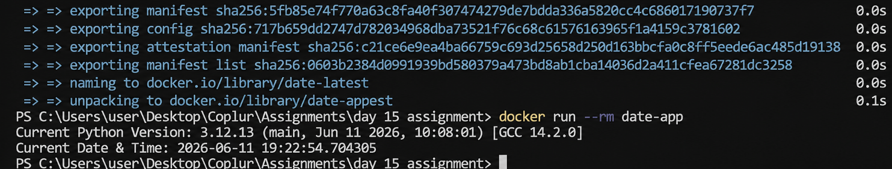

# Dockerized Python Date & Time App

A simple Python application containerized with Docker using the `python:3.12-slim` image. The application prints the current Python version and current date & time when the container starts.

## Project Structure

```text
.
├── app.py
├── Dockerfile
├── requirements.txt
├── README.md
└── docker-output.png
```

## Build the Image

```bash
docker build -t date-app .
```

## Run the Container

```bash
docker run --rm date-app
```

## Sample Output

```text
Current Python Version: 3.12.13
Current Date & Time: 2026-06-11 19:22:54.704305
```

## Screenshot



## What I Learned

* Building Docker images using a Python base image.
* Running Python applications inside containers.
* Automating application startup using Docker commands.
* Creating portable and reproducible execution environments.
